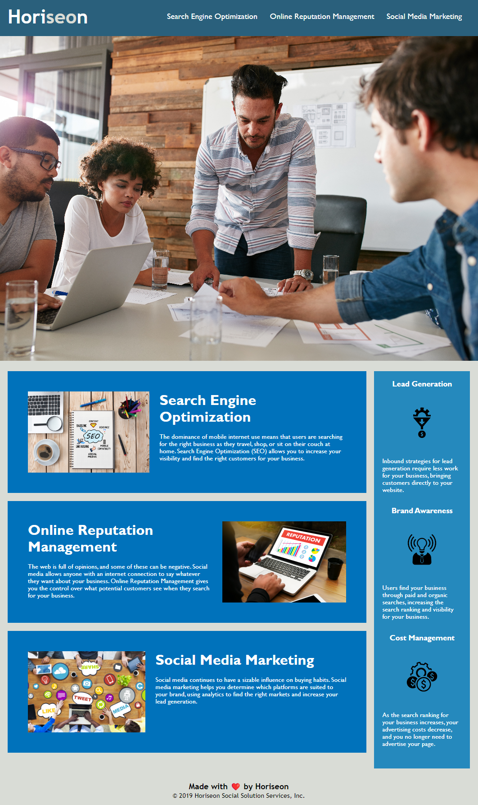

# Challenge 01

## Description

-This project was aimed at increasing the accessibility of the customer's website.

-The steps outlined were meant to improve accessibility of the website by refactoring existing code to make it more logical and compatible with various technologies and browsers.

-The project updates added more logical semantic elements, reorganized existing stylesheet attributes, added alt text for images, eliminated redundancies in stylesheet (DRY), and improved functionality of page where applicable (all links are now functional)

-This project shows that while semantic elements may not all impact the view of the page, they can impact accessibility. It also shows that code can be written more efficiently while maintaining the same functions.

## Usage

https://anuffisenough.github.io/Challenge_Module_1/

### Screenshot

## Credits

![Professional README.md Guide] https://coding-boot-camp.github.io/full-stack/github/professional-readme-guide

![Mdn web docs tutorial on HTML and accessibility] https://developer.mozilla.org/en-US/docs/Learn/Accessibility/HTML
